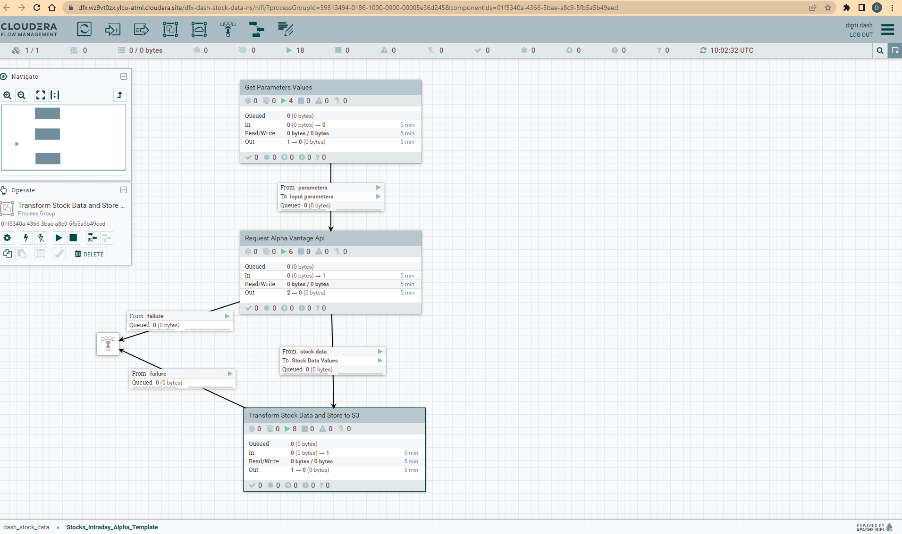

= Partner Summit 2023 - Workshop Student Guide

'''

Version : 2.0.0 + date : 14/02/2023 +

'''

image::images/bannersa.png[]

This document guides students through the Hands-on lab for Partner Summit 2023.
It will take you step by step to completing the pre-requisites and deliver this demo.

== Introduction

The purpose of this repository is to enable the easy and quick setup of the Partner Summit workshop.
Cloudera Data Platform (CDP) has been built from the ground up to support hybrid, multi-cloud data management in support of a Data Fabric architecture.
This workshop introduces CDP, with a focus on the data management capabilities that enable the Data Fabric and Data Lakehouse.

== Overview

In this exercise, we will work get stock data from https://www.alphavantage.co/[Alpha Vantage], that offers free stock APIs in JSON and CSV formats for real-time and historical stock market data.

* Data ingestion and streaming -- provided by *_Cloudera Data Flow (CDF)_* and *_Cloudera Data Engineering (CDE)_*.
* Global data access, data processing and persistence--provided by *_Cloudera Data Hub (CDH)_*.
* Data visualization with *_CDP Data Visualization_*.

*_Cloudera DataFlow (CDF)_* is a scalable, real-time streaming analytics platform that ingests, curates, and analyzes data for key insights and immediate actionable intelligence.
CDF's Flow Management is powered by Apache NiFi, a no-code data ingestion and management solution.
Apache NiFi is a very mature open-source solution meant for large scale, high velocity enterprise data ingestion use cases.

*_Cloudera Data Engineering (CDE)_* is a serverless service for Cloudera Data Platform that allows you to submit batch jobs to auto-scaling virtual clusters.
CDE enables you to spend more time on your applications, and less time on infrastructure.
CDE allows you to create, manage, and schedule Apache Spark jobs without the overhead of creating and maintaining Spark clusters.
With Cloudera Data Engineering, you define virtual clusters with a range of CPU and memory resources, and the cluster scales up and down as needed to run your Spark workloads, helping to control your cloud costs.

*_CDP Data Visualization_* enables data engineers, business analysts, and data scientists explore data quickly and easily, collaborate, and share insights across the data lifecycle--from data ingest to data insights and beyond.
Delivered natively as part of Cloudera Data Platform (CDP), Data Visualization delivers a consistent and easy to use data visualization experience with intuitive and accessible drag-and-drop dashboards and custom application creation.

image::images/architecture.png[]

== Pre-requisites

. Laptop with a supported OS (Windows 7 not supported) or MacBook.
. A modern browser - Google Chrome (IE, Firefox, Safari not supported).
. Wi-Fi Internet connection.
. Git installed.

== Step 1: Get github project

{blank}

You can use the workshop project cloning this github repository : https://github.com/DashDipti/partner-summit-2023 [Workshop Github repo]

[,console]
----
git clone https://github.com/DashDipti/partner-summit-2023
----

== Step 2: Get Alpha Vantage Key

. Go to website https://www.alphavantage.co/[Alpha Vantage].
. Choose link \-> `GET YOUR FREE API KEY TODAY`.

image::images/alphaVantagePortal.png[]

. Choose 'Student' for the question - `Which of the following best describes you?`.
. Enter your own organisation name for the question - `Organization (e.g. company, university, etc.):`
. Enter your email address for the question - `Email:`
. Click on `GET FREE API KEY`.

image::images/claimApiKey.png[]

You should see a message like - 'Welcome to Alpha Vantage! Your dedicated access key is: YXXXXXXXXXXXXXXE. 
`*Please record this API key at a safe place for future data access.*`

image:images/getKey.png[]  +

== Step 3: Access CDP Public Cloud Portal

Please use the login url: https://login.cdpworkshops.cloudera.com/auth/realms/se-workshop-1/protocol/saml/clients/cdp-sso[Workshop login] [Attention]

image::images/login1.png[]

Enter the `Username` and `Password` shared by your instructor.

image::images/login2.png[]

You should be able to get the following home page of CDP Public Cloud.

image::images/login3.png[]

== Step 4: Define Workload Password

You will need to define your workload password that will be used to acess non-SSO interfaces. You may read more about it here (https://docs.cloudera.com/management-console/cloud/user-management/topics/mc-access-paths-to-cdp.html).
Please keep it with you. If you have forgotten it, you will be able to repeat this process and define another one.

. Click on your `user name (Ex: `Test50User50`) at the lower left corner.
. Click on the `Profile` option.

image:images/setWorkloadPasswordStep1.png[]  +
image:images/setWorkloadPasswordStep2.png[]  +

. Enter a suitable `Password` and `Confirm Password`.
. Click button `Set Workload Password`.

image::images/setWorkloadPasswordStep3.png[]

{blank} +

image::images/setWorkloadPasswordStep4.png[]

Check that you got the message - `Workload password is currently set` or alternatively, look for a message next to `Workload Password` which says `(Workload password is currently set)`

== Step 5: Create the flow to ingest stock data via API to Object Storage

=== CDP Portal

{blank} +
Click on `DataFlow` icon as shown in the image below.

image::images/portalCDF.png[]

=== Create a new CDF Catalog

. On the left menu click on the option \-> `Catalog`. +
. Click the button \-> `Import Flow Definition`.

image::images/cdfManageDeploymentStep0.png[]

Fill up those parameters : +

`Flow Name` +

____
(yourUserName)_stock_data +
____

`Nifi Flow Configuration`
____
Upload the file "*https://github.com/DashDipti/partner-summit-2023/blob/main/Stocks_Intraday_Alpha_Template.json[Stocks_Intraday_Alpha_Template.json]*" + [Attention]
____

Click `Import` +

image::images/cdfImportFowDefinition.png[]

The new catalog has been added. +

image::images/cdfFlowCatalogCreated.png[]

Now let's deploy it.

=== Deploy DataFlow

Click on the small arrow towards right of the catalog you just created. Click on `Deploy` button.

image::images/cdfFlowDeploy.png[]
You will need to select the workshop environment `se-workshop-1-env`.[Attention]
Click on `Continue ->`

image::images/cdfDeploymentChooseEnv.png[]
Give a name to this dataflow +
`Deployment Name`

____
(user)_stock_data +
____
Make sure that the right `Target Environment` is selected.
Click `Next`.

image::images/cdfDeploymentStep1.png[]

Let parameters be the default ones. Click `Next`.

image::images/cdfDeploymentStep2.png[]

image::images/cdfDeploymentStep3.png[]

CDP_Password +

____
Fill up your CDP workload password here +
____

CDP_User +

____
your user +
____

S3_Path +

____
stocks +
____

api_alpha_key +

____
your Alpha Vantage key +
____

stock_list +

____
IBM +
GOOGL +
AMZN +
MSFT
____

image::images/cdfDeploymentStep4.png[]

Nifi Node Sizing +

____
Extra Small +
____

Enable "Auto scaling" +

____
Let parameters by default +
____

Click "Next" +

image::images/cdfDeploymentStep5.png[]

You can define KPI's in regards what has been specified in your dataflow, but we will skip this for now.
+ Click "Next" +

image::images/cdfDeploymentStepFinal.png[]

Click "Deploy" to launch the deployment +

image::images/cdfDeploymentStepDeploying.png[]

Check the deployment on the run.
+

image::images/cdfWorking.png[]

Dataflow is up and running.
In minutes we will start receiving stock information into our bucket.
If you want you can check in your bucket under the path s3a://se-workshop-1-aws/user/(yourusername)/stocks/new [Attention]

=== View Nifi DataFlow

Click on blue arrow on the right of your deployed dataflow.

image::images/cdfWorking.png[]

Select "Manage Deployment" on top right corner.

image::images/cdfManageDeploymentStep1.png[]

On this window, choose "Action" \-> "View in Nifi".

image::images/cdfManageDeploymentStep2.png[]

You can see the Nifi data flow that has been deployed from the json file.
Let's take a quick look together.

At this stage you can suspend this dataflow, go back to "Deployment Manager" \-> "Action" \-> "Suspend flow".
We will add a new stock later and restart it. [Attention]

image::images/cdfManageDeploymentStep2.png[]

=== Create Iceberg Table

{blank} +

Now we are going to create the Iceberg table.
+ From the CDP Portal or CDP Menu choose "Data Warehouse".

image::images/portalCDW.png[]

From the CDW Overview window, click the "HUE" button on the corner left.

image::images/cdwOverview.png[]

Now you're accessing to the sql editor called "HUE".

image::images/hueOverview.png[]

Let's *_select the Impala engine_* that you will be using for interacting with database. +
Create database using your login user050, for example replace (user) by user050 for database creation :

[,sql]
----

CREATE DATABASE <user>_stocks;
----

See the result.

image::images/cdwCreateDatabase.png[]

After create a Iceberg table, change (user) with your login:

[,sql]
----

CREATE TABLE IF NOT EXISTS <user>_stocks.stock_intraday_1min (
  interv STRING,
  output_size STRING,
  time_zone STRING,
  open DECIMAL(8,4),
  high DECIMAL(8,4),
  low DECIMAL(8,4),
  close DECIMAL(8,4),
  volume BIGINT)
PARTITIONED BY (
  ticker STRING,
  last_refreshed string,
  refreshed_at string)
STORED AS iceberg;
----

See the result

image::images/cdwCreatIcebergTable.png[]

Let's now create our engineering process.
+

== Step 6: Process and Ingest Iceberg using CDE

Now we will use Cloudera Data Engineering to check the files in the object storage, compare if it's new data, and insert them into the Iceberg table.

image::images/portalCDE.png[]

From the CDP Portal or CDP Menu choose "Data Engineering".

image::images/cdeCreateJobStep1.png[]

Let's create a job \-> click Create Job".

image::images/cdeCreateJobStep2.png[]

Job Type +

____
Choose Spark 3.2.0 +
____

Name +

____
(user)-StockIceberg +
____

Application File +

____
Select  StockIcebergResource \-> stockdatabase_2.12-1.0.jar
____

Main Class +

____
com.cloudera.cde.stocks.StockProcessIceberg
____

Arguments

____
(user)_stocks +
s3a://se-workshop-1-aws/ +
stocks +
(user) +
____

image::images/cdeCreateJobStep3-SelectResource.png[]

image::images/cdeCreateJobStep4-Parameters.png[]

Create it, not run it yet +

This application will:

* Check new files in the new directory.
* Create a temp table in Spark/cache this table and identify duplicated rows (in case that NiFi loaded the same data again).
* MERGE INTO the final table, INSERT new data or UPDATE if exists.
* Archive files in the bucket.

After execution, the processed files will be in your bucket but under the "processed"+date directory

On step7, we will query data.

But right now, let show you how to create a simple dashboard, using CDP DataViz.

== Step 7: Create Dashboard using CDP DataViz

Go back to CDW window.

image::images/cdwPortal.png[]

On the menu on the left choose Data Visualisation.

image::images/cdwDataVizStep1.png[]

Then click the "Data Viz" button on the right. +
You will access to the following window : +

image::images/dataVizNewDataset.png[]

Choose "Data" on the upper menu.

image::images/dataVizNewDatasetStep1.png[]

Click "New Connection" button on the left upper corner.

image::images/dataVizNewDatasetStep2.png[]

Name +

____
(user)_dataset +
____

Dataset Source +

____
From Table +
____

Select Database +

____
(user)_stocks
____

Select Table +

____
stock_intraday_1min
____

Select "Create".

image::images/dataVizNewDatasetStep3.png[]

Select "New Dashboard" \-> image:images/newDashBoardIco.png[] +

image::images/dataVizNewDatasetStep4.png[]

Let's drag from Data on the "Dashboard Designer" to Visuals.

Dimensions \-> ticker +

____
Move it to Visuals \-> Dimensions
____

Measures \-> #volume +

____
Move it to Visuals \-> Measures
____

image::images/dataVizNewDatasetStep5.png[]

Then on Visuals choose "Packed Bubbles" +

image::images/dataVizNewDatasetStep6.png[]

Make it public + You have succeeded in a simple way your dashboard, well done + Now let's query our data and see the time travel and snapshot capabilties of Iceberg +

== Step 8: Query Iceberg Tables in Hue and Cloudera Data Visualization

=== Iceberg Architecture

Apache Iceberg is an open table format, originally designed at Netflix to overcome the challenges faced when using already existing data lake formats like Apache Hive.

The design structure of Apache Iceberg is different from Apache Hive, where the metadata layer and data layer are managed and maintained on object storage like Hadoop, s3, etc.

It uses a file structure (metadata and manifest files) that is managed in the metadata layer.
Each commit at any timeline is stored as an event on the data layer when data is added.
The metadata layer manages the snapshot list.
Additionally, it supports integration with multiple query engines,

Any update or delete to the data layer, creates a new snapshot in the metadata layer from the previous latest snapshot and parallelly chains up the snapshot, enabling faster query processing as the query provided by users pulls data at the file level rather than at the partition level.

{blank} +

image::images/iceberg-architecture.png[]

Our example will load the intraday stock daily since the free API does not give real-time data, but we can change the Cloudera Dataflow Parameter to add one more ticker and we've scheduled to run hourly the CDE process.
After this we will be able to see the new ticker information in the dashboard and also *perform time travel using Iceberg!*

=== Iceberg snapshots

Let's see the Iceberg table history.

[,sql]
----

DESCRIBE HISTORY <user>_stocks.stock_intraday_1min;
----

{blank} +

image::images/cdfIcebergHistoryBeforeAddingStock.png[]

{blank} +

Copy and paste the snapshot_id and use it on the following impala queries:

[,sql]
----

SELECT count(*), ticker
FROM <user>_stocks.stock_intraday_1min
FOR SYSTEM_VERSION AS OF <snapshot_id>
GROUP BY ticker;
----

{blank} +

image::images/cdfIcebergHistoryAfterAddingStockStep3.png[]

{blank} +

==== Add new stock

Go to CDF, choose Actions and Suspend the flow.
Add in parameters called (stock_list)  the stock NVDA (Nvidia)

{blank} +

image:images/cdfAddStock.png[] +

Let's add on the parameter "stock_list" the stock NVDA (NVIDIA) + Apply changes +

image::images/cdfAddStockFinal.png[]

{blank} +

Start again the flow.

==== Check new snapshot history

Now let check again the snapshot history:

{blank} +

image::images/cdfIcebergHistoryAfterAddingStockStep4.png[]

{blank} +

As CDF has ingested a new stock value and then CDE has merged those value it has created new Iceberg snapshots Copy and paste the new snapshot_id and use it on the following impala query:

[,sql]
----

SELECT count(*), ticker
FROM <user>_stocks.stock_intraday_1min
FOR SYSTEM_VERSION AS OF <new_snapshot_id>
GROUP BY ticker;
----

{blank} +

image::images/cdfIcebergHistoryAfterAddingStockStep5.png[]

{blank} +

Now, we can see that this snapshot retreives the count value for stock NVDA that has been added in the CDF stock_list parameter.

If we run this query without snapshot, we get all values, because all parents and child snapshots:

[,sql]
----

SELECT count(*), ticker
FROM <user>_stocks.stock_intraday_1min
GROUP BY ticker;
----

{blank} +

image::images/cdwSimpleSelect.png[]

=== Show Data Files

[,sql]
----

show files in <user50>_stocks.stock_intraday_1min
----

{blank} +

image::images/cdwShowFiles.png[]

{blank} +
